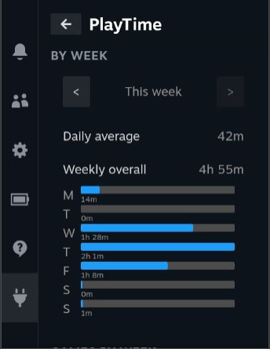

# PlayTime



PlayTime is a plugin for the SteamDeck gaming console, designed to track the amount of time you spend playing games. It provides weekly and monthly reports, as well as an overall summary of your gaming time. In addition, it offers data migration from the SteamLessTimes and MetaDeck plugins. PlayTime also allows you to manually adjust your overall playtime through the settings.

## Installation

Please note that currently, the PlayTime plugin is not available in the official Decky Plugin Store (https://plugins.deckbrew.xyz/). However, you can install it manually from the GitHub releases.

To install PlayTime manually:

1. Go to the [PlayTime GitHub repository](https://github.com/your-username/PlayTime).
2. Download the latest release package (ZIP format).
3. Extract the contents of the ZIP package to a location of your choice.

Alternatively, you can build PlayTime from source by following these steps:

1. Clone the PlayTime repository:
   ```shell
   git clone https://github.com/your-username/PlayTime.git
   ```

2. Navigate to the project directory:
   ```shell
   cd PlayTime
   ```

3. Install the development dependencies using `pnpm`:
   ```shell
   pnpm install
   ```

4. Build the plugin package:
   ```shell
   make zip
   ```

   This will generate a ZIP package containing the built plugin.

5. If you want to deploy the plugin directly to the Deck, use the following command instead:
   ```shell
   make deploy
   ```

   Make sure your SteamDeck is connected and properly set up for development.

## Development Requirements

To contribute or modify PlayTime, ensure you have the following requirements installed:

* pnpm version 8.6.x or higher

You can install `pnpm` by following the instructions in the [pnpm GitHub repository](https://github.com/pnpm/pnpm).

## Usage

Once PlayTime is installed on your SteamDeck, it will automatically start tracking your game playtime. You can access the plugin by launching the Decky Plugin Loader and selecting PlayTime from the list of installed plugins.

The main features of PlayTime include:

* Weekly and monthly reports: Get insights into your gaming habits over different time periods.
* Overall summary: View your total playtime across all games.
* Data migration: Import your playtime data from other plugins, such as SteamLessTimes and MetaDeck.
* Manual playtime adjustment: If needed, you can manually change your overall playtime through the settings.

## Contributing

Contributions to PlayTime are welcome! If you would like to contribute, please follow these steps:

1. Fork the PlayTime repository.
2. Create a new branch for your feature or bug fix.
3. Make the necessary changes in your branch.
4. Commit your changes and push them to your fork.
5. Submit a pull request to the main PlayTime repository.

Please ensure your code follows the project's coding conventions and includes appropriate tests.

## Acknowledgements

We would like to thank the contributors and supporters of PlayTime for their valuable contributions and feedback.

Special thanks to the Decky Plugin Loader project for providing the infrastructure and support for developing plugins on the SteamDeck console.

## Contact

If you have any questions, suggestions, or need assistance with PlayTime, feel free to contact us at 
Discord [PlayTime support thread](https://discord.com/channels/960281551428522045/1087800823846813716) in official [Decky Loader 
Discord](https://discord.com/invite/U88fbeHyzt) server
We appreciate your feedback!

Happy gaming with PlayTime!